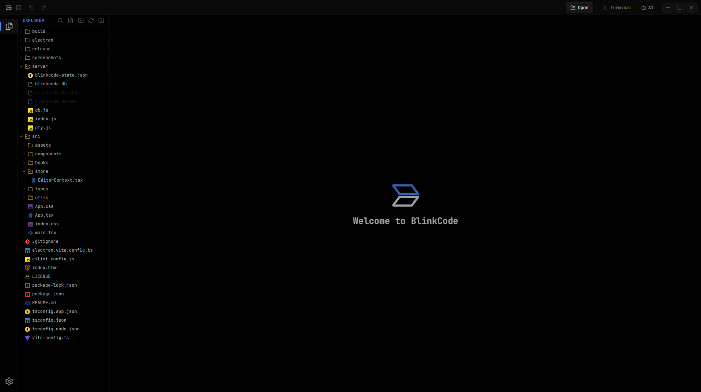

<p align="center">
  
</p>

<p align="center">
  <a href="./README.md">English</a> | <a href="./README.ru.md">Русская версия</a>
</p>

<h1 align="center">BlinkCode</h1>

<p align="center">
  Desktop-first code editor for web and app workflows.
</p>

<p align="center">
  Electron • React • TypeScript • Monaco • PTY Terminal • Windows Builds
</p>

## About

[`BlinkCode`](README.md) is a desktop-first editor for local development, focused on a fast workflow inside a single project.

It is built for:
- opening local project folders
- editing code and config files
- restoring working state between launches
- using a built-in terminal
- opening local dev-server and web links inside the app with embedded web preview
- packaging as a Windows desktop application

## Screenshots

### 1. Welcome Screen

The welcome screen now includes the animated Blink wordmark, an interactive dot grid background, and a cleaner empty-state layout for desktop workflows.

<p align="center">
  
</p>

### 2. Monaco Editor

The editor view is built around Monaco, project tabs, sidebar navigation, and desktop workflow controls.

<p align="center">
  
</p>

### 3. Settings

The settings experience is optimized for desktop use, with quick access to editor preferences, appearance controls, and dot grid color customization.

<p align="center">
  
</p>

## Main Features

### Welcome Experience and Branding
- animated Blink welcome logo with restored typewriter timing
- blue `Blink` wordmark styling to match the app brand
- interactive welcome-screen dot grid rendered by [`DotGrid`](src/components/common/DotGrid.tsx)
- configurable dot grid color stored in [`EditorContext`](src/store/EditorContext.tsx)
- themed custom color picker in [`ColorPicker`](src/components/common/ColorPicker.tsx) instead of the default system color dialog

### Stability and Safety
- safer handling for binary and unsupported files
- SQLite sidecar files such as `*.db-shm` and `*.db-wal` are treated as binary files
- improved protection against accidental file corruption when switching between unsupported and normal source files
- terminal focus behavior improved so editor typing is not redirected into the terminal when the terminal panel is open

### Editor
- [`Monaco Editor`](src/components/CodeEditor/CodeEditor.tsx) as the editing core
- autosave and state restore through [`EditorContext`](src/store/EditorContext.tsx)
- tabs with dirty-state indicators in [`TabsHeader`](src/components/TabsHeader/TabsHeader.tsx)
- breadcrumbs in [`Breadcrumb`](src/components/Breadcrumb/Breadcrumb.tsx)
- bracket pair colorization and indent guides configurable from the settings panel
- word-based suggestions disabled in favor of real LSP completions

### Language Intelligence (LSP)

BlinkCode launches real language servers and bridges them to Monaco over WebSocket, so autocomplete, diagnostics and refactors match what you get in VS Code.

- TypeScript / JavaScript / TSX / JSX via [`typescript-language-server`](package.json)
- HTML, CSS / SCSS / LESS, JSON / JSONC via [`vscode-langservers-extracted`](package.json)
- project-aware IntelliSense backed by the workspace `tsconfig.json` / `jsconfig.json`
- auto-import on completion (selecting `useState` adds `import { useState } from 'react'`)
- hover with type signatures and documentation
- go to definition (`F12`, `Ctrl+Click`)
- signature help inside calls
- rename symbol (`F2`) with cross-file edits
- find all references (`Shift+F12`)
- document outline / symbols (`Ctrl+Shift+O`)
- format document (`Shift+Alt+F`) and format selection (`Ctrl+K Ctrl+F`)
- code actions / quick fixes (`Ctrl+.`) including add missing import and organize imports
- inline diagnostics (errors, warnings, hints) with safe hover rendering
- Monaco's bundled TS/JS/HTML/CSS/JSON services are disabled so the real LSP is the single source of truth
- WebSocket bridge in [`server/lsp.js`](server/lsp.js) with `ELECTRON_RUN_AS_NODE` support for packaged builds
- Monaco adapter, JSON-RPC client and session cache in [`src/lsp/`](src/lsp)
- LSP binaries shipped via `asarUnpack` so IntelliSense works in both dev and installer / portable builds

### Navigation and Productivity
- Command Palette (`Ctrl+Shift+P`) in [`CommandPalette`](src/components/CommandPalette/CommandPalette.tsx)
- Quick Open fuzzy file picker (`Ctrl+P`) in [`QuickOpen`](src/components/QuickOpen/QuickOpen.tsx)
- Go to line (`Ctrl+G`) via Monaco
- multi-cursor and column selection via Monaco
- status bar in [`StatusBar`](src/components/StatusBar/StatusBar.tsx)
- toast notifications in [`Toast`](src/components/Toast/Toast.tsx)

### AI Assistant
- integrated AI panel in [`AIPanel`](src/components/AIPanel/AIPanel.tsx) for chat-style prompts alongside the editor

### Developer Experience
- DevTools open automatically in dev mode (`npm run electron:dev`)
- `F12` and `Ctrl+Shift+I` toggle DevTools in the Electron window
- landing onboarding in [`Landing`](src/components/Landing)

### Desktop Features
- custom Electron shell through [`electron/main.mjs`](electron/main.mjs)
- custom titlebar and window controls in [`TopHeader`](src/components/TopHeader/TopHeader.tsx)
- activity bar in [`ActivityBar`](src/components/ActivityBar/ActivityBar.tsx)
- embedded browser preview in [`BrowserPreview`](src/components/BrowserPreview/BrowserPreview.tsx) for local sites and terminal links
- Windows packaging through [`electron-builder`](package.json)

### Appearance and Settings
- language switching for English and Russian
- multiple editor themes and color schemes
- welcome-screen dot grid color setting in [`SettingsPanel`](src/components/SettingsPanel/SettingsPanel.tsx)
- custom themed color picker that opens upward inside the settings panel
- compact mode, animations, file icons, and other desktop UI preferences

### Project Workflow
- opening local folders
- file tree with rename / create / delete / drag-and-drop in [`Sidebar`](src/components/Sidebar/Sidebar.tsx)
- recent projects in the empty explorer state
- centralized file support rules in [`supportedWebFiles.ts`](src/utils/supportedWebFiles.ts)

### File Handling
- supported files open in Monaco
- unsupported text files can fall back to read-only mode
- separate handling for binary / preview / generated / large files in [`CodeEditor`](src/components/CodeEditor/CodeEditor.tsx)
- extended support for formats such as:
  - [`mdx`](src/utils/supportedWebFiles.ts)
  - [`xml`](src/utils/supportedWebFiles.ts)
  - [`ini`](src/utils/supportedWebFiles.ts)
  - [`conf`](src/utils/supportedWebFiles.ts)
  - [`graphql`](src/utils/supportedWebFiles.ts)
  - [`ps1`](src/utils/supportedWebFiles.ts)
  - [`csv`](src/utils/supportedWebFiles.ts)

### Terminal
- terminal UI based on [`xterm`](src/components/Terminal/Terminal.tsx)
- shell session transport in [`useShell`](src/hooks/useShell.ts)
- PTY manager in [`server/pty.js`](server/pty.js)
- WebSocket lifecycle in [`server/index.js`](server/index.js)
- improved terminal focus handling so the code editor keeps keyboard input when selected
- terminal links can open inside BlinkCode preview instead of only using the external browser

## Quick Start

```bash
git clone https://github.com/lovlygod/BlinkCode.git
cd BlinkCode
npm install
npm run dev
```

Open in browser: `http://127.0.0.1:5173`

## Desktop Development

Run the Electron app against the local Vite dev server:

```bash
npm run electron:dev
```

## Desktop Build

```bash
npm run dist:win
```

Build artifacts are written into [`release/`](release).

## Release Files

Current Windows artifacts:
- installer: [`release/BlinkCode-Setup-0.3.0-x64.exe`](release/BlinkCode-Setup-0.3.0-x64.exe)
- portable: [`release/BlinkCode-Portable-0.3.0-x64.exe`](release/BlinkCode-Portable-0.3.0-x64.exe)

## Tech Stack

- frontend: React + TypeScript + Vite
- editor: Monaco via [`@monaco-editor/react`](package.json)
- language servers: [`typescript-language-server`](package.json) and [`vscode-langservers-extracted`](package.json) proxied over WebSocket
- desktop shell: Electron
- packaging: [`electron-builder`](package.json)
- terminal rendering: [`xterm`](package.json)
- backend: Express + WebSocket
- persistence: local JSON-backed state in [`server/db.js`](server/db.js)

## Project Structure

```text
BlinkCode/
├── electron/
│   ├── main.mjs
│   └── preload.cjs
├── server/
│   ├── db.js
│   ├── index.js
│   ├── lsp.js
│   └── pty.js
├── screenshots/
├── src/
│   ├── components/
│   │   ├── ActivityBar/
│   │   ├── AIPanel/
│   │   ├── CodeEditor/
│   │   ├── CommandPalette/
│   │   ├── QuickOpen/
│   │   ├── Sidebar/
│   │   ├── StatusBar/
│   │   ├── TabsHeader/
│   │   ├── Terminal/
│   │   ├── Toast/
│   │   ├── TopHeader/
│   │   └── ...
│   ├── hooks/
│   ├── lsp/
│   ├── store/
│   ├── types/
│   └── utils/
├── build/
├── release/
└── package.json
```

## Important Files

- app shell: [`src/App.tsx`](src/App.tsx)
- global styling: [`src/index.css`](src/index.css)
- editor state: [`src/store/EditorContext.tsx`](src/store/EditorContext.tsx)
- file support rules: [`src/utils/supportedWebFiles.ts`](src/utils/supportedWebFiles.ts)
- welcome dot grid: [`src/components/common/DotGrid.tsx`](src/components/common/DotGrid.tsx)
- themed color picker: [`src/components/common/ColorPicker.tsx`](src/components/common/ColorPicker.tsx)
- Electron main process: [`electron/main.mjs`](electron/main.mjs)
- backend API and terminal server: [`server/index.js`](server/index.js)
- PTY manager: [`server/pty.js`](server/pty.js)
- LSP WebSocket bridge: [`server/lsp.js`](server/lsp.js)
- Monaco LSP adapter: [`src/lsp/monacoAdapter.ts`](src/lsp/monacoAdapter.ts)
- LSP session cache and URI resolver: [`src/lsp/session.ts`](src/lsp/session.ts)

## License

[`MIT`](LICENSE)
