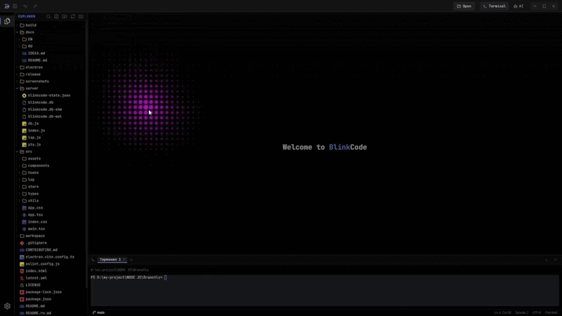
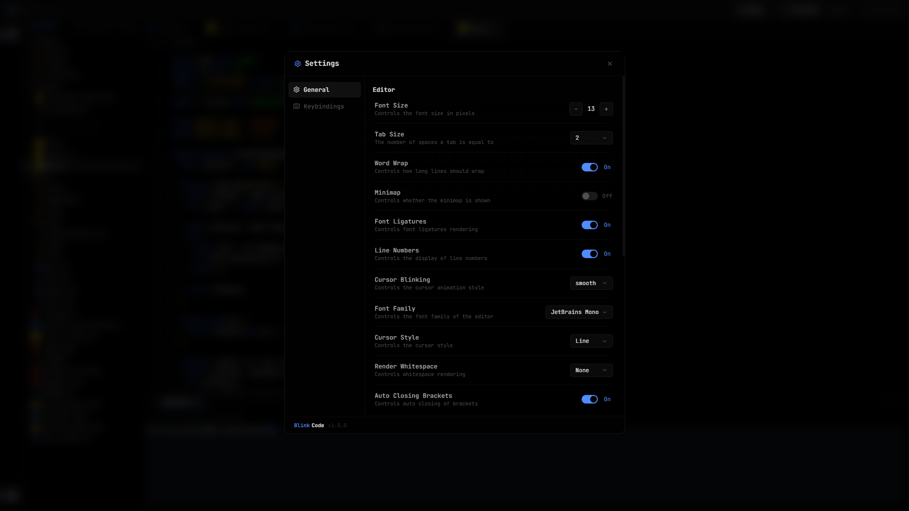

<p align="center">
  
</p>

<h1 align="center">BlinkCode</h1>

<p align="center">
  Desktop-first code editor for web and app workflows.
</p>

<p align="center">
  Electron · React · TypeScript · Monaco · Real LSP IntelliSense · PTY terminal · Windows builds
</p>

<p align="center">
  <a href="./README.md"><strong>English</strong></a>
  &nbsp;·&nbsp;
  <a href="./README.ru.md">Русская версия</a>
  &nbsp;·&nbsp;
  <a href="./docs/EN/README.md">📖 Documentation</a>
</p>

---

## Table of Contents

1. [About](#about)
2. [Screenshots](#screenshots)
3. [Features](#features)
4. [Quick start](#quick-start)
5. [Desktop build](#desktop-build)
6. [Documentation](#documentation)
7. [Tech stack](#tech-stack)
8. [Project structure](#project-structure)
9. [Contributing](#contributing)
10. [License](#license)

---

## About

**BlinkCode** is a desktop-first code editor for local development, focused
on a fast, keyboard-driven workflow inside a single project. It bridges real
language servers (TypeScript, HTML, CSS, JSON) into Monaco so you get full
IntelliSense — auto-import, rename, references, formatting, quick fixes —
alongside an embedded terminal, file tree and web preview.

## Screenshots

### Welcome screen

<p align="center">
  
</p>

### Monaco editor

<p align="center">
  
</p>

### Settings

<p align="center">
  
</p>

## Features

Highlights — full list in [`docs/EN/features.md`](./docs/EN/features.md),
all keybindings in [`docs/EN/shortcuts.md`](./docs/EN/shortcuts.md).

- **Real IntelliSense via LSP** — TypeScript / JavaScript / TSX / JSX, HTML,
  CSS / SCSS / LESS, JSON, with auto-import, rename, references, go to definition,
  formatting, code actions and inline diagnostics
- **Command Palette** (`Ctrl+Shift+P`) and **Quick Open** (`Ctrl+P`)
- **Embedded terminal** based on `xterm` with real PTY sessions
- **Embedded browser preview** for local dev servers and terminal links
- **AI panel** for chat-style prompts alongside the editor
- **Custom Electron shell** — titlebar, activity bar, status bar, toasts, onboarding
- **Configurable themes**, bracket colorization, indent guides, dot-grid welcome
- **Windows installer and portable** builds via `electron-builder`

## Quick start

```bash
git clone https://github.com/lovlygod/BlinkCode.git
cd BlinkCode
npm install
npm run dev
```

Open http://127.0.0.1:5173 in your browser.

For the full Electron experience (recommended):

```bash
npm run electron:dev
```

See [`docs/EN/development.md`](./docs/EN/development.md) for the full setup
guide and troubleshooting.

## Desktop build

```bash
npm run dist:win
```

Build artifacts are written into [`release/`](release):

- installer: `BlinkCode-Setup-0.3.0-x64.exe`
- portable: `BlinkCode-Portable-0.3.0-x64.exe`

Packaging details, `asarUnpack`, auto-update and GitHub-release flow are
documented in [`docs/EN/building.md`](./docs/EN/building.md).

## Documentation

Full documentation lives in [`docs/`](./docs/README.md):

| English | Русский |
|---|---|
| [Documentation home](./docs/README.md) | [Главная документации](./docs/README.md) |
| [Features](./docs/EN/features.md) | [Возможности](./docs/RU/features.md) |
| [Keyboard shortcuts](./docs/EN/shortcuts.md) | [Горячие клавиши](./docs/RU/shortcuts.md) |
| [Architecture](./docs/EN/architecture.md) | [Архитектура](./docs/RU/architecture.md) |
| [Language servers (LSP)](./docs/EN/lsp.md) | [Language-серверы (LSP)](./docs/RU/lsp.md) |
| [Development](./docs/EN/development.md) | [Разработка](./docs/RU/development.md) |
| [Building & packaging](./docs/EN/building.md) | [Сборка и упаковка](./docs/RU/building.md) |

## Tech stack

- **Frontend:** React + TypeScript + Vite
- **Editor:** Monaco via `@monaco-editor/react`
- **Language servers:** `typescript-language-server` and
  `vscode-langservers-extracted` proxied over WebSocket
- **Desktop shell:** Electron
- **Packaging:** `electron-builder`
- **Terminal:** `xterm`
- **Backend:** Express + WebSocket
- **Persistence:** local JSON-backed state in [`server/db.js`](./server/db.js)

## Project structure

```text
BlinkCode/
├── electron/            # main process + preload
├── server/              # HTTP / WebSocket backend
│   ├── index.js
│   ├── lsp.js           # LSP WebSocket bridge
│   ├── pty.js
│   └── db.js
├── src/
│   ├── components/      # UI (editor, sidebar, panels, …)
│   ├── lsp/             # LSP client + Monaco adapter
│   ├── hooks/
│   ├── store/
│   └── utils/
├── docs/
│   ├── EN/
│   └── RU/
├── build/
├── release/
└── package.json
```

Detailed breakdown: [`docs/EN/architecture.md`](./docs/EN/architecture.md).

## Contributing

See [`CONTRIBUTING.md`](./CONTRIBUTING.md).

## License

[MIT](./LICENSE)
