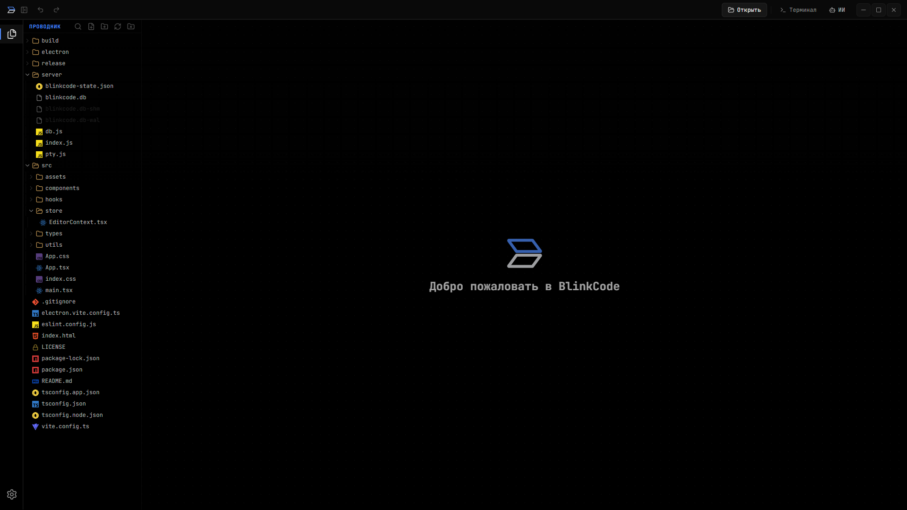
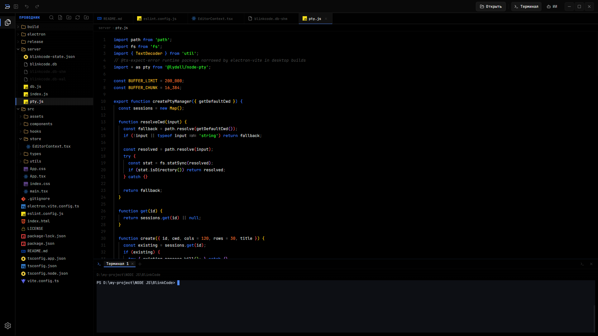
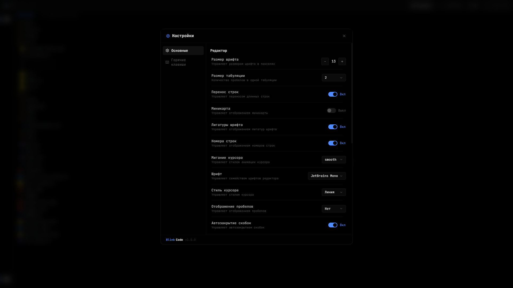

<p align="center">
  
</p>

<p align="center">
  <a href="./README.md">English</a> | <a href="./README.ru.md">Русская версия</a>
</p>

<h1 align="center">BlinkCode</h1>

<p align="center">
  Desktop-first редактор кода для web и app workflow.
</p>

<p align="center">
  Electron • React • TypeScript • Monaco • PTY Terminal • Windows Builds
</p>

## О проекте

[`BlinkCode`](README.ru.md) — это desktop-first редактор для локальной разработки, ориентированный на быстрый рабочий процесс внутри одного проекта.

Он подходит для:
- открытия локальных папок проекта
- редактирования кода и конфигов
- восстановления состояния между запусками
- использования встроенного терминала
- упаковки в Windows desktop-приложение

## Скриншоты

### 1. Приветственный экран

<p align="center">
  
</p>

### 2. Monaco Editor

<p align="center">
  
</p>

### 3. Настройки

<p align="center">
  
</p>

## Основные возможности

### Редактор
- [`Monaco Editor`](src/components/CodeEditor/CodeEditor.tsx) как основа редактора
- autosave и восстановление состояния через [`EditorContext`](src/store/EditorContext.tsx)
- вкладки с dirty-state в [`TabsHeader`](src/components/TabsHeader/TabsHeader.tsx)
- breadcrumbs в [`Breadcrumb`](src/components/Breadcrumb/Breadcrumb.tsx)

### Desktop-функции
- кастомная оболочка Electron через [`electron/main.mjs`](electron/main.mjs)
- кастомный titlebar и window controls в [`TopHeader`](src/components/TopHeader/TopHeader.tsx)
- activity bar в [`ActivityBar`](src/components/ActivityBar/ActivityBar.tsx)
- Windows packaging через [`electron-builder`](package.json)

### Работа с проектами
- открытие локальных папок
- дерево файлов с rename / create / delete / drag-and-drop в [`Sidebar`](src/components/Sidebar/Sidebar.tsx)
- recent projects в пустом состоянии проводника
- централизованные правила поддержки файлов в [`supportedWebFiles.ts`](src/utils/supportedWebFiles.ts)

### Работа с файлами
- поддерживаемые файлы открываются в Monaco
- неподдерживаемые текстовые файлы могут открываться в режиме только для чтения
- отдельная логика для binary / preview / generated / large files в [`CodeEditor`](src/components/CodeEditor/CodeEditor.tsx)
- расширенная поддержка форматов:
  - [`mdx`](src/utils/supportedWebFiles.ts)
  - [`xml`](src/utils/supportedWebFiles.ts)
  - [`ini`](src/utils/supportedWebFiles.ts)
  - [`conf`](src/utils/supportedWebFiles.ts)
  - [`graphql`](src/utils/supportedWebFiles.ts)
  - [`ps1`](src/utils/supportedWebFiles.ts)
  - [`csv`](src/utils/supportedWebFiles.ts)

### Терминал
- UI терминала на базе [`xterm`](src/components/Terminal/Terminal.tsx)
- транспорт shell-сессий в [`useShell`](src/hooks/useShell.ts)
- PTY manager в [`server/pty.js`](server/pty.js)
- WebSocket lifecycle в [`server/index.js`](server/index.js)

## Быстрый старт

```bash
git clone https://github.com/lovlygod/BlinkCode.git
cd BlinkCode
npm install
npm run dev
```

Открыть в браузере: `http://localhost:3001`

## Desktop-сборка

```bash
npm run dist:win
```

Готовые файлы появятся в папке [`release/`](release).

## Release-файлы

Текущие Windows-артефакты:
- installer: [`release/BlinkCode-Setup-0.1.0-x64.exe`](release/BlinkCode-Setup-0.1.0-x64.exe)
- portable: [`release/BlinkCode-Portable-0.1.0-x64.exe`](release/BlinkCode-Portable-0.1.0-x64.exe)

## Технологии

- frontend: React + TypeScript + Vite
- editor: Monaco через [`@monaco-editor/react`](package.json)
- desktop shell: Electron
- packaging: [`electron-builder`](package.json)
- terminal rendering: [`xterm`](package.json)
- backend: Express + WebSocket
- persistence: локальное JSON-состояние в [`server/db.js`](server/db.js)

## Структура проекта

```text
BlinkCode/
├── electron/
│   ├── main.mjs
│   └── preload.cjs
├── server/
│   ├── db.js
│   ├── index.js
│   └── pty.js
├── screenshots/
├── src/
│   ├── components/
│   │   ├── ActivityBar/
│   │   ├── CodeEditor/
│   │   ├── Sidebar/
│   │   ├── TabsHeader/
│   │   ├── Terminal/
│   │   ├── TopHeader/
│   │   └── ...
│   ├── hooks/
│   ├── store/
│   ├── types/
│   └── utils/
├── build/
├── release/
└── package.json
```

## Важные файлы

- app shell: [`src/App.tsx`](src/App.tsx)
- глобальные стили: [`src/index.css`](src/index.css)
- состояние редактора: [`src/store/EditorContext.tsx`](src/store/EditorContext.tsx)
- правила поддержки файлов: [`src/utils/supportedWebFiles.ts`](src/utils/supportedWebFiles.ts)
- Electron main process: [`electron/main.mjs`](electron/main.mjs)
- backend API и terminal server: [`server/index.js`](server/index.js)
- PTY manager: [`server/pty.js`](server/pty.js)

## Лицензия

[`MIT`](LICENSE)
