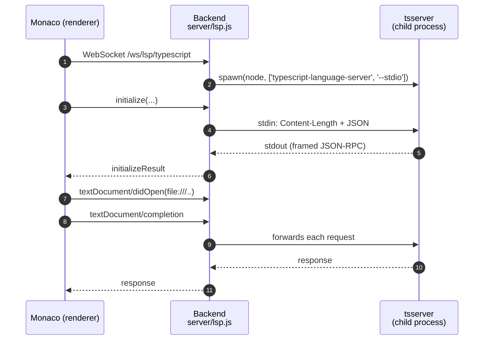

# Language servers (LSP)

  <a href="./README.md">↑ Docs home (EN)</a>
  &nbsp;·&nbsp;
  <a href="../RU/lsp.md">🇷🇺 На русском</a>
  &nbsp;·&nbsp;
  <a href="./architecture.md">→ Architecture</a>
  &nbsp;·&nbsp;
  <a href="./shortcuts.md">→ Shortcuts</a>

---

## Table of Contents

1. [Why LSP](#why-lsp)
2. [Supported servers](#supported-servers)
3. [End-to-end flow](#end-to-end-flow)
4. [Monaco providers](#monaco-providers)
5. [Auto-import](#auto-import)
6. [URI handling](#uri-handling)
7. [Packaging](#packaging)
8. [Troubleshooting](#troubleshooting)

---

## Why LSP

Monaco ships with a basic, editor-local TypeScript service. It does not know
about your project's `tsconfig.json`, installed `node_modules`, path aliases,
or non-TS diagnostics. BlinkCode replaces those bundled services with real
language servers over WebSocket, so you get the same IntelliSense as in
VS Code — including **auto-import** and cross-file refactors.

## Supported servers

| Language / area | Server | Package |
|---|---|---|
| TypeScript / JavaScript / TSX / JSX | `typescript-language-server` | [`typescript-language-server`](../../package.json) |
| HTML | `vscode-html-language-server` | [`vscode-langservers-extracted`](../../package.json) |
| CSS / SCSS / LESS | `vscode-css-language-server` | [`vscode-langservers-extracted`](../../package.json) |
| JSON / JSONC | `vscode-json-language-server` | [`vscode-langservers-extracted`](../../package.json) |

Monaco's own TS / JS / HTML / CSS / JSON services are explicitly turned off
for these languages (see [`src/lsp/session.ts`](../../src/lsp/session.ts))
so the real LSP is the single source of truth.

## End-to-end flow

- Frontend: [`src/lsp/client.ts`](../../src/lsp/client.ts) (JSON-RPC over WS,
  reconnect, request/response queueing) and
  [`src/lsp/session.ts`](../../src/lsp/session.ts) (one session per
  `workspace × server-key`, Monaco → LSP wiring).
- Backend: [`server/lsp.js`](../../server/lsp.js) spawns the language-server
  child, frames stdin/stdout with `Content-Length` headers, and pipes JSON-RPC
  messages in both directions over the WebSocket.

## Monaco providers

[`src/lsp/monacoAdapter.ts`](../../src/lsp/monacoAdapter.ts) registers one
provider per feature:

| Monaco API | LSP request |
|---|---|
| `registerCompletionItemProvider` | `textDocument/completion` + `completionItem/resolve` |
| `registerHoverProvider` | `textDocument/hover` |
| `registerDefinitionProvider` | `textDocument/definition` |
| `registerSignatureHelpProvider` | `textDocument/signatureHelp` |
| `registerRenameProvider` | `textDocument/prepareRename` + `textDocument/rename` |
| `registerReferenceProvider` | `textDocument/references` |
| `registerDocumentSymbolProvider` | `textDocument/documentSymbol` |
| `registerDocumentFormattingEditProvider` | `textDocument/formatting` |
| `registerDocumentRangeFormattingEditProvider` | `textDocument/rangeFormatting` |
| `registerCodeActionProvider` | `textDocument/codeAction` |
| Diagnostics via `monaco.editor.setModelMarkers` | `textDocument/publishDiagnostics` |

## Auto-import

When you pick `useState` from the autocomplete list, BlinkCode calls
`completionItem/resolve`, which makes tsserver return a full item that
includes `additionalTextEdits` — the import line to insert at the top of the
file. Monaco applies both the main insert and the additional edits in a
single transaction.

Implementation reference: the `resolveCompletionItem` callback and the
`lspTextEditsToMonaco` helper inside
[`src/lsp/monacoAdapter.ts`](../../src/lsp/monacoAdapter.ts).

## URI handling

tsserver only recognizes a document as part of your project when the URI
matches a real absolute path like
`file:///D:/my-project/NODE%20JS/Branchly/src/App.tsx`. Monaco uses its
own in-memory URIs by default, which do not match.

To make them match, every request goes through
`cfg.resolveUri(model)` — see
[`src/lsp/session.ts`](../../src/lsp/session.ts) — which converts the Monaco
model path into a real `file://` URI rooted at the open workspace.

Diagnostics go the other direction: `publishDiagnostics` arrives with a
`file://` URI, and we reverse-lookup the Monaco model by scanning
`monaco.editor.getModels()` and comparing `resolveUri(model)`.

## Packaging

When BlinkCode is packaged with `electron-builder`, language-server binaries
must be **unpacked** from `app.asar`, otherwise Node can't `spawn()` them:

- [`package.json`](../../package.json) adds
  `typescript-language-server`, `typescript` and `vscode-langservers-extracted`
  to `asarUnpack`.
- [`server/lsp.js`](../../server/lsp.js) looks up modules in both the dev
  layout and `process.resourcesPath/app.asar.unpacked/node_modules/...`.
- The spawned child gets `ELECTRON_RUN_AS_NODE=1`, so the Electron binary
  behaves like a plain Node runtime and can execute JS entries directly.

## Troubleshooting

- **No completions / "0 items"**: make sure a workspace folder is open.
  Without it, `resolveUri` can't build a real path and tsserver won't associate
  the document with a project.
- **`react` → `rect`**: this was the bundled Monaco TS service winning over the
  real LSP. It is now disabled in [`src/lsp/session.ts`](../../src/lsp/session.ts);
  if you see it again, check that `setModeConfiguration` still runs at startup.
- **Hover crash**: fixed by normalizing the diagnostic `code` field. If a
  custom LSP sends `code` as an object, it is coerced to a string.
- **Packaged build has no IntelliSense**: verify that `app.asar.unpacked/node_modules`
  exists after install and contains the three LSP packages.

---

<a href="#table-of-contents">↑ Back to top</a> · <a href="../README.md">↑ Docs home</a>

