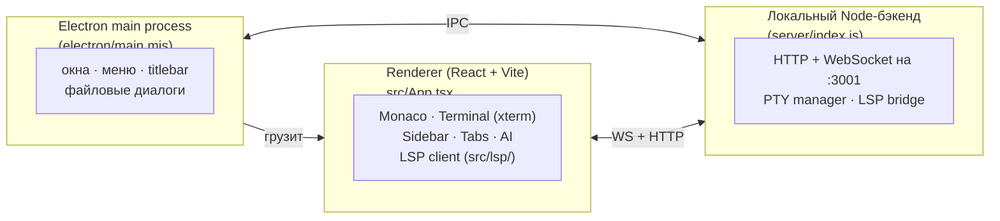

# Архитектура

<p>
  <a href="./README.md">↑ Главная документации (RU)</a>
  &nbsp;·&nbsp;
  <a href="../EN/architecture.md">🇬🇧 In English</a>
  &nbsp;·&nbsp;
  <a href="./lsp.md">→ LSP в деталях</a>
</p>

---

## Оглавление

1. [Общая схема](#общая-схема)
2. [Процессы](#процессы)
3. [Слои фронтенда](#слои-фронтенда)
4. [Слои бэкенда](#слои-бэкенда)
5. [IPC и транспорты](#ipc-и-транспорты)
6. [Состояние и персистентность](#состояние-и-персистентность)
7. [Дерево исходников](#дерево-исходников)

---

## Общая схема

BlinkCode — это Electron-приложение из трёх частей:



В dev renderer раздаётся Vite-сервером (порт `5173`), в проде — подгружается
из собранного `dist/` через `file://`.

## Процессы

- **Electron main** ([`electron/main.mjs`](../../electron/main.mjs)) создаёт
  окно, управляет кастомным titlebar и запускает локальный бэкенд в
  упакованной сборке. Регистрирует хоткеи DevTools (`F12`, `Ctrl+Shift+I`)
  и авто-открывает DevTools в dev.
- **Preload** ([`electron/preload.cjs`](../../electron/preload.cjs))
  пробрасывает минимальный типизированный API в renderer через
  `contextBridge`.
- **Бэкенд** ([`server/index.js`](../../server/index.js)) — небольшой сервер
  на Express + `ws`, отвечающий за PTY-терминалы и LSP WebSocket-мосты.
- **Renderer** — React-приложение внутри Electron-окна.

## Слои фронтенда

```
src/
├── App.tsx               — верхнеуровневый layout
├── store/EditorContext   — глобальное состояние (вкладки, настройки, workspace)
├── components/
│   ├── CodeEditor        — обёртка Monaco + подключение LSP
│   ├── Sidebar           — файловое дерево
│   ├── TabsHeader        — открытые файлы
│   ├── Breadcrumb        — хлебные крошки
│   ├── ActivityBar       — боковая панель иконок
│   ├── StatusBar         — нижняя панель
│   ├── CommandPalette    — Ctrl+Shift+P
│   ├── QuickOpen         — Ctrl+P
│   ├── Terminal          — UI xterm
│   ├── BrowserPreview    — встроенный webview
│   ├── AIPanel           — AI-чат
│   ├── SettingsPanel     — настройки
│   ├── Toast             — уведомления
│   ├── TopHeader         — кастомный titlebar
│   ├── Landing           — онбординг
│   └── common/           — DotGrid, BlinkLogo, ColorPicker
├── hooks/                — кастомные React-хуки (useShell и т.д.)
├── lsp/                  — LSP-клиент + Monaco-адаптер
├── utils/                — общие хелперы (поддержка файлов, пути и т.д.)
└── types/                — общие TypeScript-типы
```

## Слои бэкенда

```
server/
├── index.js   — HTTP + WebSocket сервер на :3001
├── pty.js     — PTY spawn/resize/write/close по WS /ws/pty
├── lsp.js     — child_process spawn + stdio-обрамление по WS /ws/lsp/:lang
└── db.js      — локальная персистентность
```

## IPC и транспорты

| Транспорт | Для чего |
|---|---|
| `contextBridge` (preload) | Renderer ↔ Electron main для файловых диалогов и window controls |
| HTTP `:3001` | Файловый API, который использует дерево файлов |
| WS `/ws/pty` | Интерактивные терминальные сессии |
| WS `/ws/lsp/:lang` | Мост JSON-RPC LSP (один сокет на язык) |

Весь WS-трафик — текстовые фреймы. В LSP-трафике используется классический
`Content-Length:`-заголовок + тело, сериализация на обоих концах.

## Состояние и персистентность

- Runtime-состояние живёт в [`EditorContext`](../../src/store/EditorContext.tsx)
  (вкладки, активный файл, курсор, настройки, workspace).
- Долговременное состояние сохраняется через [`server/db.js`](../../server/db.js)
  в `server/blinkcode-state.json`.
- Старые SQLite sidecar-файлы (`blinkcode.db*`) игнорируются редактором как
  бинарники и могут быть удалены — реальный сторадж это JSON.

## Дерево исходников

Что делает каждый компонент — см. [features.md](./features.md); глубокое
описание LSP-слоя — в [lsp.md](./lsp.md).

---

<p align="right"><a href="#оглавление">↑ Наверх</a> · <a href="../README.md">↑ Главная документации</a></p>
