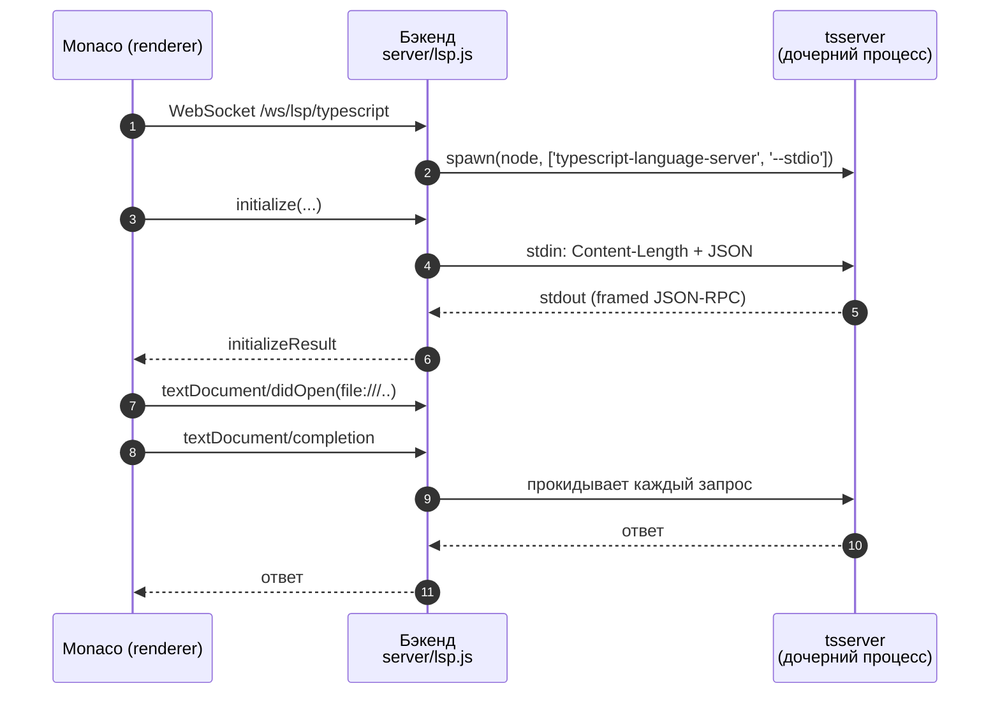

# Language-серверы (LSP)

  <a href="./README.md">↑ Главная документации (RU)</a>
  &nbsp;·&nbsp;
  <a href="../EN/lsp.md">🇬🇧 In English</a>
  &nbsp;·&nbsp;
  <a href="./architecture.md">→ Архитектура</a>
  &nbsp;·&nbsp;
  <a href="./shortcuts.md">→ Шорткаты</a>

---

## Оглавление

1. [Зачем LSP](#зачем-lsp)
2. [Поддерживаемые серверы](#поддерживаемые-серверы)
3. [End-to-end поток](#end-to-end-поток)
4. [Провайдеры Monaco](#провайдеры-monaco)
5. [Auto-import](#auto-import)
6. [Работа с URI](#работа-с-uri)
7. [Упаковка](#упаковка)
8. [Траблшутинг](#траблшутинг)

---

## Зачем LSP

Monaco из коробки идёт с базовым встроенным TypeScript-сервисом. Он не знает
про ваш `tsconfig.json`, установленные `node_modules`, path-алиасы и не
умеет не-TS диагностику. BlinkCode подменяет встроенные сервисы настоящими
language-серверами по WebSocket, и вы получаете тот же IntelliSense, что
в VS Code — **включая auto-import** и рефакторинги по нескольким файлам.

## Поддерживаемые серверы

| Язык / область | Сервер | Пакет |
|---|---|---|
| TypeScript / JavaScript / TSX / JSX | `typescript-language-server` | [`typescript-language-server`](../../package.json) |
| HTML | `vscode-html-language-server` | [`vscode-langservers-extracted`](../../package.json) |
| CSS / SCSS / LESS | `vscode-css-language-server` | [`vscode-langservers-extracted`](../../package.json) |
| JSON / JSONC | `vscode-json-language-server` | [`vscode-langservers-extracted`](../../package.json) |

Встроенные Monaco-сервисы TS / JS / HTML / CSS / JSON явно отключены
(см. [`src/lsp/session.ts`](../../src/lsp/session.ts)) — чтобы единственным
источником правды был настоящий LSP.

## End-to-end поток

- Фронт: [`src/lsp/client.ts`](../../src/lsp/client.ts) (JSON-RPC по WS,
  reconnect, очередь запросов) и
  [`src/lsp/session.ts`](../../src/lsp/session.ts) (одна сессия на
  `workspace × server-key`, подключение Monaco ↔ LSP).
- Бэкенд: [`server/lsp.js`](../../server/lsp.js) — spawn-ит child-процесс
  language-сервера, добавляет `Content-Length`-заголовки к stdin/stdout и
  прокачивает JSON-RPC через WebSocket в обе стороны.

## Провайдеры Monaco

[`src/lsp/monacoAdapter.ts`](../../src/lsp/monacoAdapter.ts) регистрирует
по одному провайдеру на каждую фичу:

| Monaco API | LSP-запрос |
|---|---|
| `registerCompletionItemProvider` | `textDocument/completion` + `completionItem/resolve` |
| `registerHoverProvider` | `textDocument/hover` |
| `registerDefinitionProvider` | `textDocument/definition` |
| `registerSignatureHelpProvider` | `textDocument/signatureHelp` |
| `registerRenameProvider` | `textDocument/prepareRename` + `textDocument/rename` |
| `registerReferenceProvider` | `textDocument/references` |
| `registerDocumentSymbolProvider` | `textDocument/documentSymbol` |
| `registerDocumentFormattingEditProvider` | `textDocument/formatting` |
| `registerDocumentRangeFormattingEditProvider` | `textDocument/rangeFormatting` |
| `registerCodeActionProvider` | `textDocument/codeAction` |
| Диагностика через `monaco.editor.setModelMarkers` | `textDocument/publishDiagnostics` |

## Auto-import

Когда вы выбираете `useState` из автокомплита, BlinkCode вызывает
`completionItem/resolve`, и tsserver возвращает полный item с
`additionalTextEdits` — строкой импорта, которую нужно вставить в начало
файла. Monaco применяет основную вставку и additionalTextEdits одной
транзакцией.

Реализация — коллбек `resolveCompletionItem` и хелпер `lspTextEditsToMonaco`
в [`src/lsp/monacoAdapter.ts`](../../src/lsp/monacoAdapter.ts).

## Работа с URI

tsserver распознаёт документ как часть проекта только если URI совпадает
с реальным абсолютным путём вроде
`file:///D:/my-project/NODE%20JS/Branchly/src/App.tsx`. У Monaco по
умолчанию свои in-memory URI, которые не совпадают.

Чтобы они совпадали, каждый запрос проходит через `cfg.resolveUri(model)`
(см. [`src/lsp/session.ts`](../../src/lsp/session.ts)), который переводит
путь Monaco-модели в настоящий `file://`-URI относительно открытого
workspace.

Диагностика идёт в обратную сторону: `publishDiagnostics` приходит с
`file://`-URI, и мы делаем обратный поиск Monaco-модели, перебирая
`monaco.editor.getModels()` и сравнивая `resolveUri(model)`.

## Упаковка

В упакованной сборке `electron-builder` бинари language-серверов должны
быть **распакованы** из `app.asar`, иначе `child_process.spawn()` не
сможет их запустить:

- [`package.json`](../../package.json) добавляет
  `typescript-language-server`, `typescript` и `vscode-langservers-extracted`
  в `asarUnpack`.
- [`server/lsp.js`](../../server/lsp.js) ищет модули и в dev-раскладке, и
  в `process.resourcesPath/app.asar.unpacked/node_modules/...`.
- Дочерний процесс получает `ELECTRON_RUN_AS_NODE=1` — тогда бинарь
  Electron ведёт себя как обычный Node и умеет выполнять JS-скрипты.

## Траблшутинг

- **Нет автокомплита / «0 items»**: убедитесь, что открыт workspace. Без
  него `resolveUri` не может собрать реальный путь и tsserver не привязывает
  документ к проекту.
- **`react` → `rect`**: это встроенный Monaco TS-сервис побеждал настоящий
  LSP. Он отключён в [`src/lsp/session.ts`](../../src/lsp/session.ts);
  если повторится — проверьте, что `setModeConfiguration` вызывается при старте.
- **Крэш на hover**: чинили нормализацией поля `code` в диагностике. Если
  кастомный LSP присылает `code` как объект, он приводится к строке.
- **Нет IntelliSense в упакованной сборке**: проверьте, что после установки
  существует `app.asar.unpacked/node_modules` и в нём лежат три LSP-пакета.

---

<a href="#оглавление">↑ Наверх</a> · <a href="../README.md">↑ Главная документации</a>

